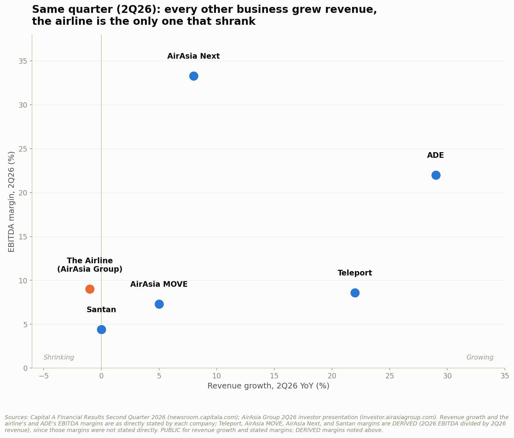

# Project 010: AirAsia / Capital A

### The Whole Ecosystem: History, the Business Empire, and the 2026 Crisis



**Part of a [11-case-study portfolio](https://github.com/ooi-darren)**, and the first built around one company's own financial statements as the core structure, pulled directly from primary-source filings rather than relying on secondary reporting.

> AirAsia's shares crashed 21% in September 2026 after reports the government was planning for other airlines to absorb its routes. But "AirAsia" today is actually two separate companies with five other businesses between them, logistics, aircraft maintenance, a travel app, a fintech brand, and a catering arm. Reading every piece of this ecosystem directly from primary filings: is the whole empire in trouble, or is this one business's crisis being mistaken for the whole group's?

## Recommendation

**Treat this as a crisis concentrated almost entirely in the airline, not evidence that Capital A's broader business empire is failing.** On the exact same quarter (2Q2026), every other business in the group grew revenue, ADE +29%, Teleport +22%, AirAsia Next +8%, AirAsia MOVE +5%, Santan flat, while the airline's revenue fell 1% and its EBITDA collapsed 56% into a net operating loss (Notebook 13). None of Capital A's five retained businesses comes close to that deterioration. Two (AirAsia MOVE, Santan) had softened over the prior two years, largely because they depend somewhat on the airline flying more planes, but that softening had already reversed into growth again by 2Q26, not because they are independently struggling. One caveat on this comparison itself: the airline's crisis is diagnosed on a balance-sheet, solvency basis (the working-capital deficit below), while the other five businesses are only checked on an income-statement basis (revenue growth, EBITDA margin), since none of them files a separate balance sheet; "every other business grew revenue" is real, but it is not the same kind of evidence as the airline's solvency stress, and should be read as directionally supportive rather than a fully like-for-like comparison (Notebook 13).

**On the airline's crisis specifically**, the RM14.5 billion working capital deficit this project reconciles directly from AirAsia Group's own balance sheet (Notebook 14) is real: the 2Q26 operating loss is genuinely traceable to an external fuel price shock rather than a broad cost failure, that part rests on the company's own disclosed numbers, not on interpretation. On urgency: the Group's own cash flow statement implies roughly 9-10 months of pure operating runway on current cash, and it is already actively rolling about RM2.8 billion of financing every six months, longer and more active than the September panic coverage's tone suggested, but the USD1 billion plus RM700 million it is separately seeking covers only around a third of the diagnosed deficit at face value, a gap this project surfaces but cannot resolve without access to information (lender term sheets, board options analysis, management's internal cash forecast) that isn't public. A rough market-multiple cross-check against VietJet suggests the market's reaction, while severe, is not obviously disproportionate to the underlying balance-sheet stress. This project's own notebooks also disagree with each other on two points that matter for how optimistic to be about the airline specifically: whether AirAsia X's 2020-2023 restructuring is a reason for confidence (Notebook 2) or whether the merged entity is simply too new to have earned that confidence yet (Notebook 7's own explanation for AirAsia's underperformance), and whether the government's lighter-touch response signals lower severity or just the absence of an ownership lever like the one it held over Malaysia Airlines in 2014 (Notebook 16 explicitly declines to say which). The honest position is that the airline's liquidity problem is real and serious, the operating loss is not self-inflicted, and the rest of the ecosystem it sits inside is, on the whole, considerably steadier than the headlines about "AirAsia" would suggest.

## Executive Summary

This project traces the entire AirAsia/Capital A ecosystem from its 1993/2001 origins through a two-decade history of parallel corporate distress and recovery, into the exact mechanics of a January 2026 reverse acquisition that split it into two separately listed companies, and finally into a direct reconciliation of both the airline's September 2026 crisis and the five other businesses (Teleport, ADE, AirAsia MOVE, AirAsia Next/BigPay, Santan) that make up the rest of the group. Capital A Berhad is the original 1993 parent, renamed from AirAsia Group Berhad in 2022; AirAsia Group Berhad today is legally the former AirAsia X Berhad, which acquired the actual airlines from Capital A in January 2026 and took over the old parent's name for itself, leaving Capital A holding a 19.5% cross-shareholding and five non-aviation businesses (Notebooks 1-4). Reading the airline's actual filed 2Q26 balance sheet directly (not press summaries) shows the widely-cited RM18.4 billion liabilities figure is real, CEO Tony Fernandes's rebuttal that only RM2.76 billion is lease liabilities is also real, but neither number is the one that matters most: a RM14.5 billion working capital deficit against RM954 million cash on hand, the actual liquidity-stress metric neither side's framing stated plainly (Notebook 14). That 2Q26 operating loss is traceable to a fuel price shock rather than a broad cost failure, since non-fuel unit costs actually improved 7% over the same period (Notebook 5). The Group's own filed cash flow statement implies roughly 9-10 months of operating runway and shows it already actively rolling ~RM2.8 billion of financing every six months, yet the USD1 billion plus RM700 million it is separately seeking covers only around a third of the deficit at face value (Notebooks 14, 17). Checked against the airline's own regional competitors, VietJet grew revenue and profit substantially over a comparable period while AirAsia's was roughly flat, and Malaysia's flag carrier MAG posted its fourth consecutive profitable year (Notebook 7), real evidence the pressure is company-specific. Put side by side with the rest of the ecosystem on the exact same quarter (Notebook 13), the picture sharpens further: every one of Capital A's five retained businesses grew revenue in 2Q26 (ADE +29%, Teleport +22%, AirAsia Next +8%, AirAsia MOVE +5%, Santan flat), while the airline's revenue fell 1%, the only one of the six businesses examined in this project to shrink that quarter. Capital A's own 18% share-price fall on the same crisis day is a real, calculable consequence of its 19.5% stake in AirAsia Group, not sentiment contagion (Notebook 15). Six fiscal years of the airline's own revenue and profit history (FY2020-FY2025, Notebook 5) show the September 2026 crisis is not its first severe test, four straight years of pandemic-era losses preceded its first post-pandemic profitable year in FY2023, though the group has also shown a pattern of premature all-clear signals worth weighing against its current messaging (Notebook 17).

## Research Question

**Is the September 2026 "AirAsia crisis" a genuine solvency risk facing the whole business empire, or a crisis concentrated in one part of it (the airline) that the rest of the ecosystem (five other businesses under Capital A) is largely insulated from, and what does reading every piece directly from primary filings actually show?**

## Key Findings

**1. The crisis is concentrated in the airline, not the wider ecosystem.** On the exact same quarter (2Q2026), every one of Capital A's five retained businesses grew revenue (ADE +29%, Teleport +22%, AirAsia Next +8%, AirAsia MOVE +5%, Santan flat), while the airline's revenue fell 1% and its EBITDA collapsed 56% into a net operating loss, the only business among the six examined in this project to shrink that quarter (Notebook 13).

**2. Both the panic headline and the CEO's rebuttal on the airline's balance sheet are individually accurate, and both miss the real number.** RM18.41bn current liabilities (the headline) and RM2.76bn current lease liabilities (Fernandes's rebuttal) are both confirmed directly from the filed 2Q26 balance sheet; the real liquidity-stress metric, a RM14.5bn working capital deficit against RM954m cash, was stated by neither (Notebook 14).

**3. The airline's 2Q26 operating loss is fuel-driven, not a broad cost failure.** Average fuel price rose from $110/barrel (1Q26) to $183/barrel (2Q26); CASK ex-fuel actually improved 7% over the same period, evidence of real cost discipline outside the fuel line (Notebook 5).

**4. The financing being sought covers only about a third of the diagnosed deficit.** The RM14.5bn working capital deficit (USD~3.65bn equivalent) dwarfs the USD1bn plus RM700m (USD~1.18bn equivalent) the airline is seeking; this project cannot say whether the rest is meant to self-resolve or come from a lever not yet disclosed (Notebooks 14, 17).

**5. On a pure operating basis, the airline's cash runway is longer than the panic tone suggested, but it is already leaning hard on financing.** RM954m cash implies roughly 9-10 months of runway at the 1H2026 burn rate; in the same six months the Group raised RM2.81bn in new financing while repaying RM2.40bn, and its prior RM1bn private placement is already 100% utilised (Notebook 14).

**6. ADE posted the fastest growth of any business in the group, in either direction.** 2Q26 revenue +29% year-on-year with a 22% EBITDA margin, the highest stated margin among Capital A's non-licensing businesses; Teleport grew revenue 22% and delivered its fourth consecutive profitable quarter (Notebooks 8-9).

**7. AirAsia's pressure looks more company-specific than industry-wide.** VietJet grew revenue and profit substantially over a comparable period while AirAsia's was roughly flat; Malaysia Aviation Group posted its fourth consecutive profitable year; Batik Air discloses no financials at all (Notebook 7).

**8. AirAsia X survived something more severe than this before.** Its 2020-2023 restructuring paid creditors 0.5% of RM33.65 billion owed, and it exited PN17 status in November 2023, becoming the very entity that later absorbed Capital A's aviation businesses in January 2026 (Notebook 2).

**9. Capital A's 18% share crash is a real, calculable balance-sheet link, not contagion.** Its confirmed 19.5% stake in AirAsia Group was worth approximately RM337 million at crash-day prices, about a third of Capital A's own entire market capitalisation (Notebook 15).

**10. A rough valuation cross-check does not support "the market overreacted."** AirAsia Group trades at roughly 0.08x annualised revenue against VietJet's 1.2x, a directional signal that the market's severe reaction is broadly consistent with the underlying balance-sheet stress this project independently diagnosed (Notebook 15).

**11. The government's response so far is lighter-touch than its own 2014 precedent.** Malaysia Airlines was delisted via a RM1.38bn Khazanah buyout with special legislation in 2014-2015; AirAsia's 2026 situation has produced an external consultancy review and contingency conversations, no ownership action confirmed (Notebook 16).

## Explain It Simply

In September 2026, AirAsia's stock crashed 21% after news that the government was quietly planning for other airlines to take over its routes. But "AirAsia" today isn't one company, it's two separate businesses (Capital A and AirAsia Group) plus five smaller businesses underneath Capital A: a logistics arm, an aircraft maintenance business, a travel app, a fintech and loyalty brand, and a catering company. This project checked every piece of that ecosystem individually against the companies' own real financial filings, not just the airline everyone was reading headlines about. The result: the crisis is real, but it's the airline's crisis specifically. Its profit collapsed by more than half and flipped into an actual loss, driven mostly by jet fuel prices nearly doubling, not mismanagement. Meanwhile, two of the five smaller businesses (the maintenance arm and the logistics business) actually grew and got more profitable over the same period, and the other three only softened a little, mostly because they sell things (flights, travel bookings, inflight meals) that depend on the airline flying enough planes. If you only read headlines about "AirAsia's crisis," you'd assume the whole empire was in trouble. The real, numbers-backed picture is narrower and more specific than that.

(New to terms like "PN17," "CASK," "cross-shareholding," or "working capital deficit"? See the Glossary near the bottom.)

## Why This Research Matters

News coverage of AirAsia's crisis almost entirely covered the airline in isolation, without asking what the rest of the business empire it sits inside actually looks like, or even being clear about which of the two separate companies ("Capital A" versus "AirAsia Group") a given headline is even about. This project pulled the real quarterly reports and investor presentations directly from AirAsia Group, Capital A, VietJet, J&T Express, SIA Engineering, and Grab Holdings' own investor relations pages, extracted the underlying figures by hand, and built a genuine business-unit-by-business-unit comparison, following the same PUBLIC/DERIVED/ESTIMATED sourcing discipline as every other case study in this portfolio, and disclosing plainly where a claim from earlier research turned out to be wrong or where a competitor comparison simply isn't possible with the data that exists.

## History and Group Structure

Who is actually the "mother" company here (Capital A, not AirAsia Group, despite the confusing name history), AirAsia's 1993 founding and 2001 RM1 buyout, the COVID-19 operational collapse that triggered everything that followed, the January 2022 rename to Capital A, the twin 2020-2023 PN17 sagas of AirAsia X and Capital A, the exact mechanics of the January 2026 reverse acquisition that flipped which company is legally on top, and a full current map of who owns what (both companies' subsidiaries, the 19.5% cross-shareholding, and a live legal dispute over BigPay and Teleport shares), in `notebooks/01_history_and_origins.ipynb`, `notebooks/02_covid_collapse_and_twin_pn17_sagas.ipynb`, `notebooks/03_the_2026_restructuring_journey.ipynb`, and `notebooks/04_group_structure_today.ipynb` (Visualisations 1-4).

## The Airline, On Its Own

Six fiscal years (FY2020-FY2025) of the airline's own revenue and profit history, its real Q1-Q2 2026 unit economics and the fuel-price shock behind the 2Q26 operating loss, a correction of a wrong fleet-grounding claim (while flagging an unreconciled discrepancy in the company's own disclosures), real route-level detail behind its capacity cuts, and an honest three-tier competitive comparison against VietJet, Malaysia Aviation Group, and Batik Air, in `notebooks/05_the_airline_business_model_and_unit_economics.ipynb`, `notebooks/06_the_airline_fleet_and_capacity.ipynb`, and `notebooks/07_the_airline_competitive_position.ipynb` (Visualisations 5-7).

## The Rest of the Empire, Business by Business

Multi-year trends and, where real data exists, a competitor check for each of Capital A's five retained businesses: Teleport's logistics model against J&T Express, ADE's aircraft maintenance business against SIA Engineering, AirAsia MOVE's genuine two-year revenue and profit decline, AirAsia Next's headline growth number put in context alongside BigPay's own legal cloud and a comparison against Grab's much larger fintech arm, and Santan's real strategic pivot away from inflight catering, closing with a portfolio scorecard putting all six businesses (five plus the airline) side by side on the same period, in `notebooks/08_teleport.ipynb`, `notebooks/09_ade.ipynb`, `notebooks/10_airasia_move.ipynb`, `notebooks/11_airasia_next_and_bigpay.ipynb`, `notebooks/12_santan.ipynb`, and `notebooks/13_portfolio_scorecard.ipynb` (Visualisations 8-13).

## The Crisis, Diagnosed

The anchor notebook for the airline's own crisis: a direct reconciliation of the RM18.4bn/RM2.8bn/RM14.5bn numbers from the actual filed balance sheet, plus a real cash-burn and runway check from the Group's own filed cash flow statement, in `notebooks/14_the_current_crisis_diagnosed.ipynb` (Visualisation 14).

## Shareholders, Valuation, and Government Response

The real mechanics behind Capital A's own share crash, a rough valuation cross-check against VietJet on whether the market's reaction was proportionate, and how the government's response compares to the 2014 MAS precedent, in `notebooks/15_shareholder_and_market_impact.ipynb` and `notebooks/16_government_glc_intervention_playbook.ipynb` (Visualisations 15-16).

## Future Scenarios, Modeling, and a Summary Dashboard

A four-scenario framework (not a prediction); a direct check of whether the financing being sought actually closes the diagnosed deficit (it covers roughly a third, at face value); an observation connecting two dates four months apart worth weighing against management's own track record of premature all-clear signals; an explicit statement of what this project structurally cannot see from public disclosures alone; a small, honestly-caveated regression on the fuel-cost relationship; and a static summary dashboard built from this project's own SQL database, in `notebooks/17_future_scenarios_and_whats_next.ipynb` and `notebooks/18_modeling_and_dashboard.ipynb` (Visualisations 17-18).

## Key Strategic Insights

### Insight 1: A crisis in one business unit does not mean the whole ecosystem is failing, and this project can prove it rather than assert it

**DATA:** In 2Q2026, the airline's revenue fell 1% and EBITDA collapsed 56% into a net operating loss; in the exact same quarter, every one of Capital A's five retained businesses grew revenue (ADE +29%, Teleport +22%, AirAsia Next +8%, AirAsia MOVE +5%, Santan flat).

**INSIGHT:** Headlines about "AirAsia's crisis" implicitly generalise from the airline to the whole business empire; the actual segment-level data shows the deterioration is heavily concentrated in the one business (the airline) most directly exposed to fuel prices.

**BUSINESS IMPLICATION:** An investor or analyst assessing exposure to "AirAsia" needs to know which of the two companies, and which of the six businesses within them, they actually mean; treating the group as a single unit of risk would misprice both the airline's real distress and the other businesses' relative stability.

**STRATEGIC CONSIDERATION:** The 2026 corporate split (Notebook 3) did what such splits are structurally meant to do: it concentrated aviation-specific risk inside one entity while giving the retained businesses real, if imperfect, insulation, a genuine outcome this project can verify rather than assume.

### Insight 2: The real liquidity metric was missing from the public debate entirely

**DATA:** RM18.41bn current liabilities and RM2.76bn current lease liabilities are both confirmed directly from the filed 2Q26 statement; current assets are only RM3.87bn, producing a RM14.5bn working capital deficit against RM954m cash.

**INSIGHT:** A dispute framed as "which number is true" obscured a third number, the actual asset-versus-liability gap, that both sides had access to but neither stated.

**BUSINESS IMPLICATION:** An analyst relying on either the panic headline or the company's own rebuttal alone would misjudge the actual severity of the liquidity position in opposite directions.

**STRATEGIC CONSIDERATION:** Public financial disputes should be checked against the primary filing directly before adopting either side's framing; this project's own SQL database and notebooks show exactly how to do that reproducibly.

### Insight 3: An external, largely temporary shock explains more of the airline's crisis than mismanagement does

**DATA:** Average fuel price rose from $110/barrel (1Q26) to $183/barrel (2Q26); CASK ex-fuel improved 7% over the same period.

**INSIGHT:** The operating loss driving the crisis narrative is substantially attributable to a global commodity shock, not a broad breakdown in cost control.

**BUSINESS IMPLICATION:** If fuel prices ease, a meaningful share of the current pressure could reverse without any restructuring action; if they don't, the pressure persists regardless of what the airline does internally.

**STRATEGIC CONSIDERATION:** Assessments of the airline's turnaround prospects should track fuel price trends explicitly as a leading indicator, not treat the crisis as a fixed, internally-caused state.

### Insight 4: The financing pipeline and the deficit it's meant to close are not the same size, and this project cannot see why

**DATA:** RM14.5bn working capital deficit (Notebook 14) is roughly USD3.65bn equivalent; the USD1bn plus RM700m being sought (Notebook 17) is roughly USD1.18bn equivalent, about 32% of the deficit.

**INSIGHT:** Either the financing is meant to bridge only part of a deficit that partly self-resolves through normal airline working-capital dynamics, or there is a further lever (cost cuts, asset sales, the capital reduction exercise) closing the rest that this project's public sources do not disclose.

**BUSINESS IMPLICATION:** A reader treating the financing round as "the fix" for the RM14.5bn number would be overstating what it actually covers; the two figures should not be read as matched.

**STRATEGIC CONSIDERATION:** This is the clearest example in the project of its own stated ceiling: it can diagnose the gap precisely from public filings, but resolving whether the financing plan is actually sufficient requires information (lender term sheets, board options analysis) that isn't public.

### Insight 5: The government's lighter response is genuinely ambiguous, and this project should say so rather than pick the flattering reading

**DATA:** 2014 MAS: Khazanah buyout (RM1.38bn), delisting, special legislation, 12-point recovery plan. 2026 AirAsia: external consultancy review (Alton Aviation), contingency conversations, no ownership action, no bailout confirmed.

**INSIGHT:** A lighter government toolkit this time could mean a milder assessment of severity, or it could simply mean the government lacks the ownership lever it held over MAS in 2014 (Khazanah was already MAS's majority shareholder; the state holds no comparable stake in AirAsia Group). Notebook 16 presents both readings and does not resolve which is correct.

**BUSINESS IMPLICATION:** Treating the lighter response as confirmation of lower severity would overstate what this project's own evidence actually supports; treating it as proof of higher severity would be equally unsupported in the other direction.

**STRATEGIC CONSIDERATION:** Scenario planning for this situation (Notebook 17) should track the refinancing outcome and fuel prices as the two real swing factors, rather than reading the government's posture as a signal of which way the outcome leans.

## Methodology

Full sourcing discipline follows this portfolio's standing convention: every figure classified PUBLIC / DERIVED / ESTIMATED, primary company filings preferred over press summaries, and every figure paired with compliance context and a direct reference, checked proactively during research rather than as a cleanup step. A wrong claim surfaced during early research (the fleet-grounding figure) was corrected against the primary source rather than left uncorrected; a data-legality issue (verbatim redistribution of whole source PDFs) was identified and resolved by gitignoring the raw documents while keeping the extracted figures, cited with attribution. Competitor comparisons were built honestly to whatever data actually exists: full financial comparisons where a real, publicly-reporting competitor exists (VietJet, J&T Express, SIA Engineering, Grab), and an explicit, disclosed data gap where none does (Batik Air, AirAsia MOVE's OTA competitors, Santan), rather than forcing a number that isn't there.

A second, separate data-legality issue was found and addressed the same way: AirAsia Group's 2Q26 investor presentation carries a "strictly private and confidential, no reproduction" legend on its final page despite being hosted at a public, unauthenticated URL. Most of the specific figures this project drew from it (RASK/CASK, load factor, fleet count) are also independently stated in the Group's formal 2Q26 Quarterly Announcement (a public Bursa filing carrying no such restriction) and have been re-cited there. A small number of figures genuinely exist only in the presentation (the fleet reactivation breakdown behind Notebook 6's central finding, specific route-closure counts, and the forward-booking data in Notebook 5); these are kept, with the confidentiality marking and the reasoning for citing them disclosed explicitly in each notebook, rather than silently relied upon or silently dropped.

## Data Sources

AirAsia Group Berhad and Capital A Berhad investor relations filings (quarterly statements, cash flow statements, and presentations, 2024-2026, primary source, cited with attribution, not redistributed verbatim); AirAsia Group / Capital A full-year, 1Q2026, and 2Q2026 financial results press releases, FY2020 through 2Q2026 (AirAsia Newsroom, capitala.com, newsroom.capitala.com); VietJet Aviation JSC 2025 Annual Report (audited); J&T Express FY2025 results press release (audited/publicly reported); SIA Engineering Group full-year results press release (publicly listed, SGX); Grab Holdings Ltd FY2025 earnings release (SEC filings); VietJet market capitalisation via financial-data aggregators (ESTIMATED, not a primary filing); EIA jet fuel price data (US public domain); FRED (St. Louis Fed) MYR/USD exchange rate (open with attribution); Malaysia Aviation Group and Batik Air figures via press coverage (DERIVED, no primary filings exist); Khazanah Nasional press releases; Bursa Malaysia PN17 announcements. Full inline citations in each notebook.

## Notebooks

| # | Question | Data Rigor |
|---|---|---|
| [01: History & Origins](./notebooks/01_history_and_origins.ipynb) | How did AirAsia, AirAsia X, and Capital A get here, and who is actually the mother company? | PUBLIC |
| [02: COVID Collapse & the Twin PN17 Sagas](./notebooks/02_covid_collapse_and_twin_pn17_sagas.ipynb) | Has this group survived something like this before? | PUBLIC |
| [03: The 2026 Restructuring Journey](./notebooks/03_the_2026_restructuring_journey.ipynb) | What actually happened in January 2026? | PUBLIC |
| [04: Group Structure Today](./notebooks/04_group_structure_today.ipynb) | Who owns what, right now? | PUBLIC |
| [05: The Airline: Business Model & Unit Economics](./notebooks/05_the_airline_business_model_and_unit_economics.ipynb) | What do six years of the airline's own real numbers say? | PUBLIC + DERIVED |
| [06: The Airline: Fleet & Capacity](./notebooks/06_the_airline_fleet_and_capacity.ipynb) | Is the fleet actually being grounded at scale? | PUBLIC |
| [07: The Airline: Competitive Position](./notebooks/07_the_airline_competitive_position.ipynb) | Is this company-specific or industry-wide? | PUBLIC + DERIVED |
| [08: Teleport](./notebooks/08_teleport.ipynb) | Is Capital A's biggest business actually good on its own merits? | PUBLIC + DERIVED |
| [09: ADE](./notebooks/09_ade.ipynb) | How competitive is the maintenance business at real regional scale? | PUBLIC + DERIVED |
| [10: AirAsia MOVE](./notebooks/10_airasia_move.ipynb) | The one business that shrank, why? | PUBLIC |
| [11: AirAsia Next & BigPay](./notebooks/11_airasia_next_and_bigpay.ipynb) | What's behind the headline growth number, and the legal cloud over BigPay? | PUBLIC + DERIVED |
| [12: Santan](./notebooks/12_santan.ipynb) | What can honestly be said about the thinnest-data business? | PUBLIC + DERIVED |
| [13: Portfolio Scorecard](./notebooks/13_portfolio_scorecard.ipynb) | Side by side, what's actually winning and losing? | PUBLIC + DERIVED |
| [14: The Current Crisis, Diagnosed](./notebooks/14_the_current_crisis_diagnosed.ipynb) | Genuine solvency risk, or an amplified number, and how urgent is it really? | PUBLIC + DERIVED |
| [15: Shareholder & Market Impact](./notebooks/15_shareholder_and_market_impact.ipynb) | Why did Capital A's shares crash too, and was the reaction proportionate? | PUBLIC + DERIVED + ESTIMATED |
| [16: Government/GLC Intervention Playbook](./notebooks/16_government_glc_intervention_playbook.ipynb) | How does this compare to the 2014 MAS precedent? | PUBLIC |
| [17: Future Scenarios](./notebooks/17_future_scenarios_and_whats_next.ipynb) | What does a realistic range of outcomes look like, and does the financing plan actually close the gap? | DERIVED |
| [18: Modeling & Dashboard](./notebooks/18_modeling_and_dashboard.ipynb) | What does the fuel-cost relationship look like formally? | PUBLIC + DERIVED |

## Limitations

The regression in Notebook 18 uses only four comparable quarters of operating data and is explicitly not a reliable predictive model, shown for illustration only; the executive dashboard in the same notebook is a static image, not a live or interactive BI tool, a genuine tooling boundary rather than a data gap; Malaysia Aviation Group's figures are annual only and DERIVED from press coverage since it publishes no quarterly IR-style statements; Batik Air Malaysia publishes no financial statements at all, so its comparison (Notebook 7) is limited to fleet and route counts; the VietJet comparison (Notebook 7) compares a full fiscal year against a single AirAsia quarter, not a perfectly matched period; AirAsia MOVE (Notebook 10) and Santan (Notebook 12) have no usable publicly-disclosed competitor at all, a genuine data gap rather than an oversight; the valuation cross-check (Notebook 15) uses VietJet's market cap from a secondary aggregator, not a primary filing, and ignores leverage entirely; the Teleport-vs-J&T-Express and ADE-vs-SIA-Engineering comparisons (Notebooks 8-9) involve currency conversion at an approximate exchange rate and structurally different business models, so the scale gaps are directional, not precise; the portfolio scorecard's EBITDA margin comparison (Notebook 13) is not fully fair across six structurally different business models, since a licensing-heavy business like AirAsia Next naturally runs a higher margin than a physical-infrastructure business like ADE without that reflecting better execution; AirAsia MOVE's own 1Q26 and 2Q26 disclosed EBITDA figures do not sum cleanly to its own disclosed 1H26 total, an unreconciled discrepancy disclosed in Notebook 10 rather than resolved; AirAsia Group's own 2Q26 disclosures contain two different, unreconciled figures for how much of its fleet was non-operational (Notebook 6), and this project discloses rather than resolves that discrepancy; this project has no access to lender term sheets, board options analysis, or management's internal cash forecast, so it can diagnose the financing-versus-deficit gap (Notebook 17) precisely but cannot resolve it; and this entire project describes a live, unresolved situation as of publication, so the future-scenario framework (Notebook 17) is explicitly scenarios, not a forecast.

## Glossary

Plain-language definitions for the technical terms used in this project.

- **PN17 (Practice Note 17)**: Bursa Malaysia's classification for financially distressed listed companies.
- **RASK / CASK**: Revenue and Cost per Available Seat Kilometre, the standard airline unit-economics measures.
- **Working capital deficit**: when current liabilities exceed current assets, a standard liquidity-stress signal.
- **Reverse acquisition**: an accounting treatment where the legal acquirer is treated as the accounting acquiree, used when the legal subsidiary is economically the larger business.
- **GLC (Government-Linked Company)**: a company in which the Malaysian government, often through Khazanah Nasional, holds a significant or controlling stake.
- **Cash burn rate**: the pace at which a company's cash balance is depleted by ongoing operations, usually expressed per month; tells you how much runway a fixed cash balance actually buys.
- **Market Cap / Revenue multiple**: a rough valuation ratio comparing what the market pays for a company's equity against its revenue, used here as a quick, explicitly-caveated proportionality cross-check, not a full valuation.
- **AOC (Air Operator Certificate)**: the regulatory licence required to operate an airline; AirAsia Group consolidates six of these.
- **Associate**: a company in which an investor holds significant influence but not control, accounted for differently from a consolidated subsidiary.
- **Cross-shareholding**: when one company owns a minority equity stake in another, creating financial exposure without control or consolidation.
- **MRO (Maintenance, Repair, and Overhaul)**: the aviation industry term for aircraft maintenance services.
- **Belly space**: the cargo hold underneath a passenger aircraft, used to carry freight alongside passengers.
- **Base effect**: when a very large percentage growth figure is driven mainly by a small starting number rather than genuinely fast underlying growth.
- **Scorecard**: a side-by-side comparison of multiple business units on the same set of metrics, used to spot which are outperforming or underperforming the group as a whole.
- **PUBLIC / DERIVED / ESTIMATED**: How traceable a number in this project is. **PUBLIC** = taken directly from an official source. **DERIVED** = built by combining, calculating, or extracting from official/company sources this project directly checked. **ESTIMATED** = based on a secondary source that couldn't be independently verified.

## Reproducibility

```bash
pip install -r requirements.txt
jupyter notebook notebooks/
```

All processed data (the SQLite database and small CSVs in `data/processed/`) is committed to this repository. The full source PDFs behind them (AirAsia/Capital A quarterly filings, VietJet's annual report) are **not** committed, per this project's own compliance check: citing extracted figures with attribution is standard practice, but redistributing whole third-party documents verbatim is a different, higher-risk act this project chose not to take. The small EIA and FRED data files (US public domain / open with attribution) are committed in full.

## Project Structure

```
airasia-capital-a/
├── README.md
├── data/
│   ├── raw/            # EIA, FRED pulls (committed); source PDFs (gitignored, see Reproducibility)
│   └── processed/       # SQLite database and small CSVs, the actual data this project computed
├── notebooks/            # 01-18, narrative walkthrough
├── python/
│   └── visualisation/     # House chart style
├── outputs/
│   └── figures/            # 21 PNG visualisations
├── requirements.txt
├── LICENSE
└── .gitignore
```

## Sources

Full inline citations with links in each notebook's closing "Sources" cell.

## Author

Darren Ooi, [LinkedIn](https://www.linkedin.com/in/darrenooizhixian)
