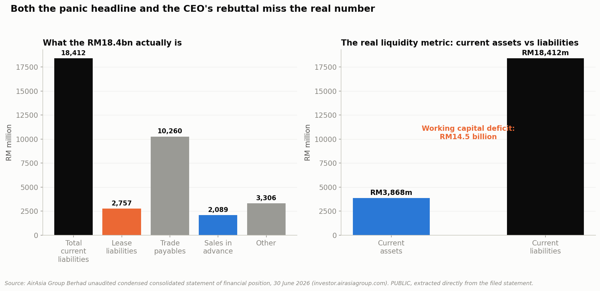

# Project 010: AirAsia / Capital A

### History, Restructuring, and the 2026 Crisis



**Part of a [10-case-study portfolio](https://github.com/ooi-darren)**, and the first built around one company's own financial statements as the core structure, pulled directly from primary-source filings rather than relying on secondary reporting.

> AirAsia's shares crashed 21% in September 2026 after reports the government was planning for other airlines to absorb its routes. The CEO called the panic overblown. Reading the actual filed numbers directly: which side is right, and what does either answer mean for a business assessing exposure to this company right now?

## Recommendation

**Treat the RM14.5 billion working capital deficit this project reconciles directly from AirAsia Group's own balance sheet as the one solid finding here, larger and more specific than either the panic headline or the CEO's rebuttal separately conveyed, and treat everything else in this project as context rather than proof of how the crisis resolves.** The 2Q26 operating loss is genuinely traceable to an external fuel price shock rather than a broad cost failure, that part rests on the company's own disclosed numbers, not on interpretation. On urgency specifically: the Group's own cash flow statement implies roughly 9-10 months of pure operating runway on current cash, and it is already actively rolling about RM2.8 billion of financing every six months, longer and more active than the September panic coverage's tone suggested, but the USD1 billion plus RM700 million it is separately seeking covers only around a third of the diagnosed deficit at face value, a gap this project surfaces but cannot resolve without access to information (lender term sheets, board options analysis, management's internal cash forecast) that isn't public. A rough market-multiple cross-check against VietJet suggests the market's reaction, while severe, is not obviously disproportionate to the underlying balance-sheet stress. But this project's own notebooks disagree with each other on two points that matter for how optimistic to be: whether AirAsia X's 2020-2023 restructuring is a reason for confidence (Notebook 3) or whether the merged entity is simply too new to have earned that confidence yet (Notebook 8's own explanation for AirAsia's underperformance), and whether the government's lighter-touch response signals lower severity or just the absence of an ownership lever like the one it held over Malaysia Airlines in 2014 (Notebook 10 explicitly declines to say which). An earlier draft of this recommendation resolved both in the optimistic direction without acknowledging that tension; it is corrected here. The honest position is that the liquidity problem is real and serious, the operating loss is not self-inflicted, and beyond that, the evidence gathered in this project does not clearly support leaning toward either a calm or an alarming outcome. The Key Strategic Insights section below works through this, including where the evidence pulls in two directions at once.

## Executive Summary

This project traces AirAsia and its parent Capital A from their 1993/2001 origins through a two-decade history of parallel corporate distress and recovery, into the exact mechanics of a January 2026 reverse acquisition, and finally into a direct reconciliation of the balance sheet numbers behind the September 2026 crisis headlines. AirAsia was founded in 1993 and bought by Tony Fernandes for RM1 plus ~RM40 million in debt in December 2001; its long-haul affiliate AirAsia X, founded 2006, separately survived a brutal 2020-2023 restructuring that paid creditors just 0.5% of the RM33.65 billion they were owed before exiting PN17 distressed-issuer status in November 2023, becoming clean enough to serve as the vehicle that absorbed Capital A's own aviation businesses in a January 2026 reverse acquisition, closing Capital A's own six-year PN17 chapter in May 2026. Reading the actual filed 2Q26 balance sheet directly (not press summaries) shows the widely-cited RM18.4 billion liabilities figure is real (it is total current liabilities), CEO Tony Fernandes's rebuttal that only RM2.76 billion is lease liabilities is also real, but neither number is the one that matters most: current assets of only RM3.87 billion against it produce a RM14.5 billion working capital deficit against RM954 million cash on hand, the actual liquidity-stress metric neither side's framing stated plainly. That 2Q26 operating loss is traceable to a fuel price shock (average fuel cost $110 to $183/barrel between 1Q26 and 2Q26) rather than a broad cost failure, since non-fuel unit costs actually improved 7% over the same period. Checked against competitors, VietJet grew revenue 13.9% and profit 51.3% over a comparable period while AirAsia's was roughly flat, and Malaysia's own flag carrier MAG just posted its fourth consecutive profitable year, real evidence AirAsia's pressure is company-specific rather than a regional slump. Capital A's own 18% share-price fall on the same crisis day is not sentiment contagion but a direct, calculable consequence of its real 19.5% ownership stake in AirAsia Group. The government's contingency planning (checking whether Malaysia Airlines and Batik Air could absorb domestic routes, hiring Alton Aviation Consultancy to independently assess funding needs) is a markedly lighter-touch response than its 2014 Khazanah-led delisting and buyout of Malaysia Airlines, suggesting either a less severe assessment of the situation or a structural absence of the ownership lever Khazanah held over MAS. The company's own filed cash flow statement implies roughly 9-10 months of operating runway on current cash and shows the Group already actively rolling ~RM2.8 billion of financing every six months, yet the USD1 billion plus RM700 million it is separately seeking covers only around a third of the RM14.5 billion deficit at face value, a mismatch this project surfaces but, without access to non-public information, cannot resolve. A rough Market Cap/Revenue cross-check against VietJet (AirAsia Group trades roughly 15x cheaper on this measure) suggests the market's reaction is not obviously disproportionate to the underlying stress. Six fiscal years of the group's own revenue and profit history (FY2020-FY2025) also show the September 2026 crisis is not the first severe test: four straight years of pandemic-era losses preceded the group's first post-pandemic profitable year in FY2023.

## Research Question

**Is AirAsia Group's September 2026 financial crisis a genuine solvency risk the market correctly priced in, or a specific number that got amplified past what it actually means, and what does the underlying evidence say either way?**

## Key Findings

**1. Both the panic headline and the CEO's rebuttal are individually accurate, and both miss the real number.** RM18.41bn current liabilities (the headline) and RM2.76bn current lease liabilities (Fernandes's rebuttal) are both confirmed directly from the filed 2Q26 balance sheet; the real liquidity-stress metric, a RM14.5bn working capital deficit against RM954m cash, was stated by neither.

**2. The 2Q26 operating loss is fuel-driven, not a broad cost failure.** Average fuel price rose from $110/barrel (1Q26) to $183/barrel (2Q26); CASK ex-fuel actually improved 7% over the same period, evidence of real cost discipline outside the fuel line.

**3. AirAsia X survived something more severe than this before.** Its 2020-2023 restructuring paid creditors 0.5% of RM33.65 billion owed, and it exited PN17 status in November 2023, becoming the very entity that later absorbed Capital A's aviation businesses in January 2026.

**4. A widely-cited fleet crisis figure turned out to be wrong.** Early research suggested ~30% of the fleet was grounded; the company's own disclosures show a 2.4% reduction (245 to 239 aircraft), with a disclosed, orderly 25-aircraft renewal plan behind it.

**5. AirAsia's pressure looks more company-specific than industry-wide.** VietJet grew revenue 13.9% and profit 51.3% (FY2025) over a comparable period; Malaysia Aviation Group posted its fourth consecutive profitable year; Batik Air, the other carrier named in route-absorption reports, discloses no financials at all.

**6. Capital A's 18% share crash is a real, calculable balance-sheet link, not contagion.** Its confirmed 19.5% stake in AirAsia Group was worth approximately RM337 million at crash-day prices, about a third of Capital A's own entire market capitalisation.

**7. The government's response so far is lighter-touch than its own 2014 precedent.** Malaysia Airlines was delisted via a RM1.38bn Khazanah buyout with special legislation in 2014-2015; AirAsia's 2026 situation has produced an external consultancy review and contingency conversations, no ownership action, no legislation, no bailout confirmed as planned.

**8. The financing being sought covers only about a third of the diagnosed deficit.** The RM14.5bn working capital deficit (USD~3.65bn equivalent) dwarfs the USD1bn plus RM700m (USD~1.18bn equivalent) AirAsia is seeking; this project cannot say whether the rest is meant to self-resolve through structural airline working-capital dynamics or come from a lever not yet disclosed.

**9. On a pure operating basis, the cash runway is longer than the panic tone suggested, but the Group is already leaning hard on financing.** RM954m cash implies roughly 9-10 months of runway at the 1H2026 operating burn rate; in the same six months the Group raised RM2.81bn in new financing while repaying RM2.40bn of existing obligations, and its prior RM1bn private placement (July 2024) is already 100% utilised.

**10. A rough valuation cross-check does not support "the market overreacted."** AirAsia Group trades at roughly 0.08x annualised revenue against VietJet's 1.2x, a directional signal that the market's severe reaction is broadly consistent with, not disproportionate to, the underlying balance-sheet stress this project independently diagnosed.

## Explain It Simply

In September 2026, AirAsia's stock crashed 21% after news that the government was quietly planning for other airlines to take over its routes if things got worse. The company's CEO pushed back hard, saying the scary RM18.4 billion debt figure everyone was citing wasn't the full story. Digging into AirAsia's own actual financial filings shows both of them were telling the truth, and both were leaving something out. The company really does have RM18.4 billion in bills due within a year, and the CEO is right that only a small slice of that is loans on planes. But the real problem is simpler than either framing: AirAsia only has about RM3.9 billion in cash and short-term assets to cover those RM18.4 billion in bills, a RM14.5 billion gap. That's a genuine, serious cash crunch. At the same time, one real reason not to panic completely holds up on its own: the loss driving this crunch is mostly explained by jet fuel prices nearly doubling in three months, not the company mismanaging itself. Two other reassuring facts, that AirAsia's sister airline survived a much worse crisis before, and that the government's response so far looks gentler than in past airline troubles, turned out to cut both ways once checked against this project's own other findings, so they're presented honestly here as open questions rather than reasons for confidence.

(New to terms like "PN17," "CASK," or "working capital deficit"? See the Glossary near the bottom.)

## Why This Research Matters

News coverage of AirAsia's crisis largely repeated one alarming number or one company rebuttal without reconciling either against the actual filed financial statements. This project pulled the real quarterly reports and investor presentations directly from AirAsia Group, Capital A, and VietJet's own investor relations pages, extracted the underlying figures by hand, and tested both sides of the public debate against them, following the same PUBLIC/DERIVED/ESTIMATED sourcing discipline as every other case study in this portfolio, and disclosing plainly where a claim from earlier research turned out to be wrong (the fleet grounding figure) or where a data source had to be excluded on legal grounds.

## History, Business Model, and Two Restructurings

AirAsia's 1993 founding and 2001 RM1 buyout, six fiscal years (FY2020-FY2025) of the group's own revenue and profit history, from a RM1.7 billion COVID-era revenue trough to its first post-pandemic profitable year and into the accounting fragmentation that preceded the 2026 merger, the COVID-19 operational collapse that actually triggered everything that followed (an 87% year-on-year revenue fall and roughly 2,400 layoffs in 2020), the January 2022 rename to Capital A as the group tried to position itself as more than an airline, and the twin 2020-2023 PN17 sagas of AirAsia X and Capital A that resolved separately before enabling the January 2026 merger, in `notebooks/01_history_and_origins.ipynb`, `notebooks/02_business_model_and_unit_economics.ipynb`, and `notebooks/03_twin_pn17_sagas.ipynb` (Visualisations 1-3).

## The 2026 Restructuring and Capital A's Retained Businesses

The reverse acquisition's exact mechanics, the real revenue discontinuity it created, and how Capital A's retained non-aviation businesses (Teleport, ADE, BigPay) are actually performing, including a live legal dispute over BigPay and Teleport shares, in `notebooks/04_the_2026_restructuring_journey.ipynb` and `notebooks/05_where_capital_as_other_businesses_fit.ipynb` (Visualisations 4-5).

## The Crisis, Diagnosed

The anchor notebook: a direct reconciliation of the RM18.4bn/RM2.8bn/RM14.5bn numbers from the actual filed balance sheet, plus a real cash-burn and runway check from the Group's own filed cash flow statement (roughly 9-10 months of operating runway, and RM2.8bn of financing already being actively rolled every six months), in `notebooks/06_the_current_crisis_diagnosed.ipynb` (Visualisation 6).

## Fleet, Competitors, Shareholders, and Government Response

Correcting a wrong fleet-grounding claim, while flagging an unreconciled discrepancy between AirAsia's own quarterly report and its own investor presentation on the same metric; real route-level detail behind the capacity cuts (64 permanent route closures YTD, concentrated in Indonesia and the Philippines); an honest three-tier competitive comparison (VietJet/MAG/Batik Air); the real mechanics behind Capital A's own share crash plus a rough valuation cross-check against VietJet on whether the market's reaction was proportionate; and how the government's response compares to the 2014 MAS precedent, in `notebooks/07_fleet_and_capacity_rationalization.ipynb`, `notebooks/08_competitive_position.ipynb`, `notebooks/09_shareholder_and_market_impact.ipynb`, and `notebooks/10_government_glc_intervention_playbook.ipynb` (Visualisations 7-10).

## Future Scenarios, Modeling, and a Summary Dashboard

A four-scenario framework (not a prediction); a direct check of whether the financing being sought actually closes the diagnosed deficit (it covers roughly a third, at face value); an observation connecting two dates elsewhere in this project, only four months apart, that are worth weighing against management's own track record of premature all-clear signals; an explicit statement of what this project structurally cannot see from public disclosures alone; a small, honestly-caveated regression on the fuel-cost relationship; and a static summary dashboard built from this project's own SQL database, in `notebooks/11_future_scenarios_and_whats_next.ipynb` and `notebooks/12_modeling_and_dashboard.ipynb` (Visualisations 11-13).

## Key Strategic Insights

### Insight 1: The real liquidity metric was missing from the public debate entirely

**DATA:** RM18.41bn current liabilities and RM2.76bn current lease liabilities are both confirmed directly from the filed 2Q26 statement; current assets are only RM3.87bn, producing a RM14.5bn working capital deficit against RM954m cash.

**INSIGHT:** A dispute framed as "which number is true" obscured a third number, the actual asset-versus-liability gap, that both sides had access to but neither stated.

**BUSINESS IMPLICATION:** An analyst relying on either the panic headline or the company's own rebuttal alone would misjudge the actual severity of the liquidity position in opposite directions.

**STRATEGIC CONSIDERATION:** Public financial disputes should be checked against the primary filing directly before adopting either side's framing; this project's own SQL database and notebooks show exactly how to do that reproducibly.

### Insight 2: An external, largely temporary shock explains more of this crisis than mismanagement does

**DATA:** Average fuel price rose from $110/barrel (1Q26) to $183/barrel (2Q26); CASK ex-fuel improved 7% over the same period.

**INSIGHT:** The operating loss driving the crisis narrative is substantially attributable to a global commodity shock, not a broad breakdown in cost control.

**BUSINESS IMPLICATION:** If fuel prices ease, a meaningful share of the current pressure could reverse without any restructuring action; if they don't, the pressure persists regardless of what AirAsia does internally.

**STRATEGIC CONSIDERATION:** Assessments of AirAsia's turnaround prospects should track fuel price trends explicitly as a leading indicator, not treat the crisis as a fixed, internally-caused state.

### Insight 3: The government's lighter response is genuinely ambiguous, and this project should say so rather than pick the flattering reading

**DATA:** 2014 MAS: Khazanah buyout (RM1.38bn), delisting, special legislation, 12-point recovery plan. 2026 AirAsia: external consultancy review (Alton Aviation), contingency conversations, no ownership action, no bailout confirmed.

**INSIGHT:** A lighter government toolkit this time could mean a milder assessment of severity, or it could simply mean the government lacks the ownership lever it held over MAS in 2014 (Khazanah was already MAS's majority shareholder; the state holds no comparable stake in AirAsia Group). Notebook 10 presents both readings and does not resolve which is correct; an earlier draft of this README used only the first, more reassuring one.

**BUSINESS IMPLICATION:** Treating the lighter response as confirmation of lower severity would overstate what this project's own evidence actually supports; treating it as proof of higher severity would be equally unsupported in the other direction.

**STRATEGIC CONSIDERATION:** Scenario planning for this situation (Notebook 11) should track the refinancing outcome and fuel prices as the two real swing factors, rather than reading the government's posture as a signal of which way the outcome leans.

### Insight 4: The financing pipeline and the deficit it's meant to close are not the same size, and this project cannot see why

**DATA:** RM14.5bn working capital deficit (Notebook 6) is roughly USD3.65bn equivalent; the USD1bn plus RM700m being sought (Notebook 11) is roughly USD1.18bn equivalent, about 32% of the deficit.

**INSIGHT:** Either the financing is meant to bridge only part of a deficit that partly self-resolves through normal airline working-capital dynamics, or there is a further lever (cost cuts, asset sales, the capital reduction exercise) closing the rest that this project's public sources do not disclose.

**BUSINESS IMPLICATION:** A reader treating the financing round as "the fix" for the RM14.5bn number would be overstating what it actually covers; the two figures should not be read as matched.

**STRATEGIC CONSIDERATION:** This is the clearest example in the project of its own stated ceiling: it can diagnose the gap precisely from public filings, but resolving whether the financing plan is actually sufficient requires information (lender term sheets, board options analysis) that isn't public.

## Methodology

Full sourcing discipline follows this portfolio's standing convention: every figure classified PUBLIC / DERIVED / ESTIMATED, primary company filings preferred over press summaries, and every figure paired with compliance context and a direct reference, checked proactively during research rather than as a cleanup step. A wrong claim surfaced during early research (the fleet-grounding figure) was corrected against the primary source rather than left uncorrected; a data-legality issue (verbatim redistribution of whole source PDFs) was identified and resolved by gitignoring the raw documents while keeping the extracted figures, cited with attribution.

## Data Sources

AirAsia Group Berhad and Capital A Berhad investor relations filings (quarterly statements, cash flow statements, and presentations, 2024-2026, primary source, cited with attribution, not redistributed verbatim); AirAsia Group / Capital A full-year financial results press releases, FY2020 through FY2025 (AirAsia Newsroom, capitala.com); VietJet Aviation JSC 2025 Annual Report (audited); VietJet market capitalisation via financial-data aggregators (ESTIMATED, not a primary filing); EIA jet fuel price data (US public domain); FRED (St. Louis Fed) MYR/USD exchange rate (open with attribution); Malaysia Aviation Group and Batik Air figures via press coverage (DERIVED, no primary filings exist); Khazanah Nasional press releases; Bursa Malaysia PN17 announcements. Full inline citations in each notebook.

## Notebooks

| # | Question | Data Rigor |
|---|---|---|
| [01: History & Origins](./notebooks/01_history_and_origins.ipynb) | How did AirAsia and AirAsia X get here? | PUBLIC |
| [02: Business Model & Unit Economics](./notebooks/02_business_model_and_unit_economics.ipynb) | What do six years of AirAsia's own real numbers say about its business model and unit economics? | PUBLIC + DERIVED |
| [03: Twin PN17 Sagas](./notebooks/03_twin_pn17_sagas.ipynb) | Has this group survived something like this before? | PUBLIC |
| [04: The 2026 Restructuring Journey](./notebooks/04_the_2026_restructuring_journey.ipynb) | What actually happened in January 2026? | PUBLIC |
| [05: Capital A's Other Businesses](./notebooks/05_where_capital_as_other_businesses_fit.ipynb) | Did the split actually insulate Capital A? | PUBLIC + DERIVED |
| [06: The Current Crisis, Diagnosed](./notebooks/06_the_current_crisis_diagnosed.ipynb) | Genuine solvency risk, or an amplified number, and how urgent is it really? | PUBLIC + DERIVED |
| [07: Fleet & Capacity Rationalization](./notebooks/07_fleet_and_capacity_rationalization.ipynb) | Is the fleet actually being grounded at scale? | PUBLIC |
| [08: Competitive Position](./notebooks/08_competitive_position.ipynb) | Is this company-specific or industry-wide? | PUBLIC + DERIVED |
| [09: Shareholder & Market Impact](./notebooks/09_shareholder_and_market_impact.ipynb) | Why did Capital A's shares crash too, and was the reaction proportionate? | PUBLIC + DERIVED + ESTIMATED |
| [10: Government/GLC Intervention Playbook](./notebooks/10_government_glc_intervention_playbook.ipynb) | How does this compare to the 2014 MAS precedent? | PUBLIC |
| [11: Future Scenarios](./notebooks/11_future_scenarios_and_whats_next.ipynb) | What does a realistic range of outcomes look like, and does the financing plan actually close the gap? | DERIVED |
| [12: Modeling & Dashboard](./notebooks/12_modeling_and_dashboard.ipynb) | What does the fuel-cost relationship look like formally? | PUBLIC + DERIVED |

## Limitations

The regression in Notebook 12 uses only four comparable quarters of operating data and is explicitly not a reliable predictive model, shown for illustration only; the executive dashboard in the same notebook is a static image, not a live or interactive BI tool, a genuine tooling boundary rather than a data gap; Malaysia Aviation Group's figures are annual only and DERIVED from press coverage since it publishes no quarterly IR-style statements; Batik Air Malaysia publishes no financial statements at all, so its comparison (Notebook 8) is limited to fleet and route counts; the VietJet comparison (Notebook 8) compares a full fiscal year against a single AirAsia quarter, not a perfectly matched period; the valuation cross-check (Notebook 9) uses VietJet's market cap from a secondary aggregator, not a primary filing, dated a few months apart from AirAsia's own crash-day price, and ignores leverage entirely; AirAsia Group's own 2Q26 disclosures contain two different, unreconciled figures for how much of its fleet was non-operational (Notebook 7), and this project discloses rather than resolves that discrepancy; the demand-side read in Notebook 2 rests on AirAsia's own forward-booking claims, which cannot be independently verified against an outside data source; this project has no access to lender term sheets, board options analysis, or management's internal cash forecast, so it can diagnose the financing-versus-deficit gap (Notebook 11) precisely but cannot resolve it; and this entire project describes a live, unresolved situation as of publication, so the future-scenario framework (Notebook 11) is explicitly scenarios, not a forecast.

## Glossary

Plain-language definitions for the technical terms used in this project.

- **PN17 (Practice Note 17)**: Bursa Malaysia's classification for financially distressed listed companies.
- **RASK / CASK**: Revenue and Cost per Available Seat Kilometre, the standard airline unit-economics measures.
- **Working capital deficit**: when current liabilities exceed current assets, a standard liquidity-stress signal.
- **Reverse acquisition**: an accounting treatment where the legal acquirer is treated as the accounting acquiree, used when the legal subsidiary is economically the larger business.
- **GLC (Government-Linked Company)**: a company in which the Malaysian government, often through Khazanah Nasional, holds a significant or controlling stake.
- **Cash burn rate**: the pace at which a company's cash balance is depleted by ongoing operations, usually expressed per month; tells you how much runway a fixed cash balance actually buys.
- **Market Cap / Revenue multiple**: a rough valuation ratio comparing what the market pays for a company's equity against its revenue, used here as a quick, explicitly-caveated proportionality cross-check, not a full valuation.
- **PUBLIC / DERIVED / ESTIMATED**: How traceable a number in this project is. **PUBLIC** = taken directly from an official source. **DERIVED** = built by combining, calculating, or extracting from official/company sources this project directly checked. **ESTIMATED** = based on a secondary source that couldn't be independently verified.

## Reproducibility

```bash
pip install -r requirements.txt
jupyter notebook notebooks/
```

All processed data (the SQLite database and small CSVs in `data/processed/`) is committed to this repository. The full source PDFs behind them (AirAsia/Capital A quarterly filings, VietJet's annual report) are **not** committed, per this project's own compliance check: citing extracted figures with attribution is standard practice, but redistributing whole third-party documents verbatim is a different, higher-risk act this project chose not to take. The small EIA and FRED data files (US public domain / open with attribution) are committed in full.

## Project Structure

```
airasia-capital-a/
├── README.md
├── data/
│   ├── raw/            # EIA, FRED pulls (committed); source PDFs (gitignored, see Reproducibility)
│   └── processed/       # SQLite database and small CSVs, the actual data this project computed
├── notebooks/            # 01-12, narrative walkthrough
├── python/
│   └── visualisation/     # House chart style
├── outputs/
│   └── figures/            # 15 PNG visualisations
├── requirements.txt
├── LICENSE
└── .gitignore
```

## Sources

Full inline citations with links in each notebook's closing "Sources" cell.

## Author

Darren Ooi, [LinkedIn](https://www.linkedin.com/in/darrenooizhixian)
